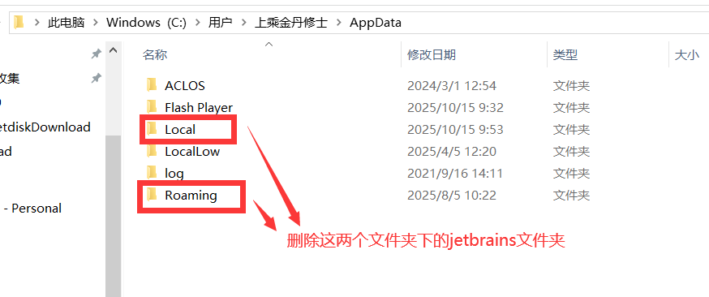
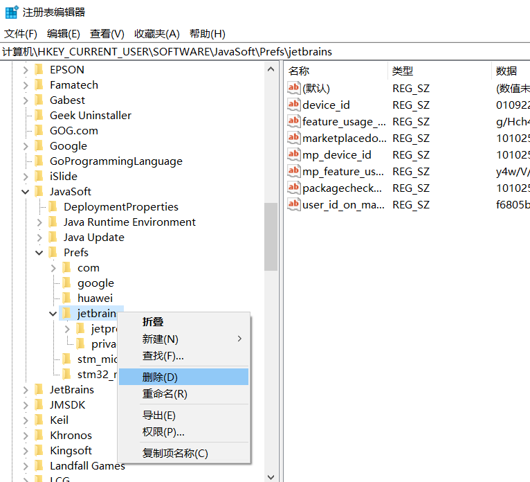
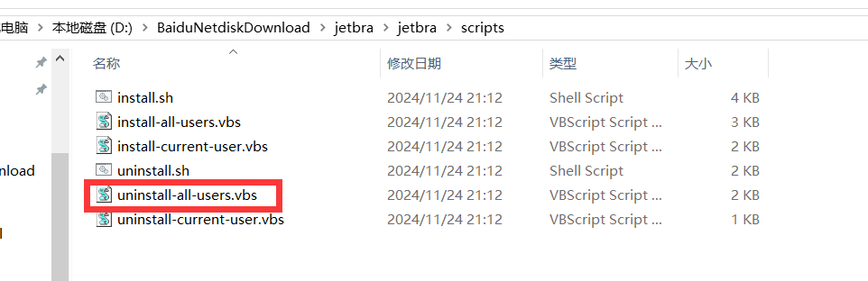

+++
title = '【拓展】PhpStorm'
date = 2025-10-17T09:42:46+08:00
description = ["描述"]
draft = true
comments= true
categories = [
    "笔记",
    "拓展",
]
image = "background.jpg"

+++

## key is invalid

<blockquote class="alert-tip">

（一般删除激活文件后，重新下载运行就能解决）

</blockquote>

原因如下：

- 激活工具未下载或者没有配置，返回查看教程，激活码无法单独使用，必须配合激活工具一起使用
- 激活工具的路径配置有误，请核对
- 配置完激活工具，未重启IDE开发工具，正常是不用的，避免你在配置的时候就打开了IDE，最好还是重启下，如果工具已经启动，配置完插件之后，请务必重启一下工具再使用激活码
- 登录了账号，如果你登录了自己未授权订阅的账号，请退出，重新激活
- 受到其他激活工具的影响，jetbrains是允许安装多版本的，如果你有安装其他版本的其他激活工具，可能会互相干扰，请核对
- 重启电脑，极少部分电脑重启工具也不会生效插件，必须重启电脑，可以尝试
- 如果重启电脑后还不行，Windows电脑执行uninstall-all-users.vbs，然后再执行install-all-users.vbs，成功后，再次激活尝试，还不行就再重启一次电脑

如果是idea，pycharm出现，一般需要重启下电脑，然后重新激活即可，如果不行，请参考**解决方案一**

## 解决方案一：删除注册表与缓存

如果激活失败，请确保是否安装过一些**vb脚本**，这个会影响jar包的加载，请务必先删除缓存并将软件卸载干净，重新激活，删除方式请参考：

### 删除本地缓存

删除用户目录下的jetbrains缓存，一般在AppData目录下，如图所示

### 删除注册表信息

Win+R输入regedit，打开注册表，删除如下目录jetbrains文件夹

 \> 计算机\HKEY_CURRENT_USER\SOFTWARE\JavaSoft\Prefs\jetbrains

### 删除历史环境变量

请打开你下载的激活工具

windows系统，双击打开执行下  uninstall-all-users.vbs

<blockquote class="alert-note">   

【[终极方案](https://ziby0nwxdov.feishu.cn/wiki/OyLBwBd9oiVFTykXrHvcEB91nyb)】

</blockquote>