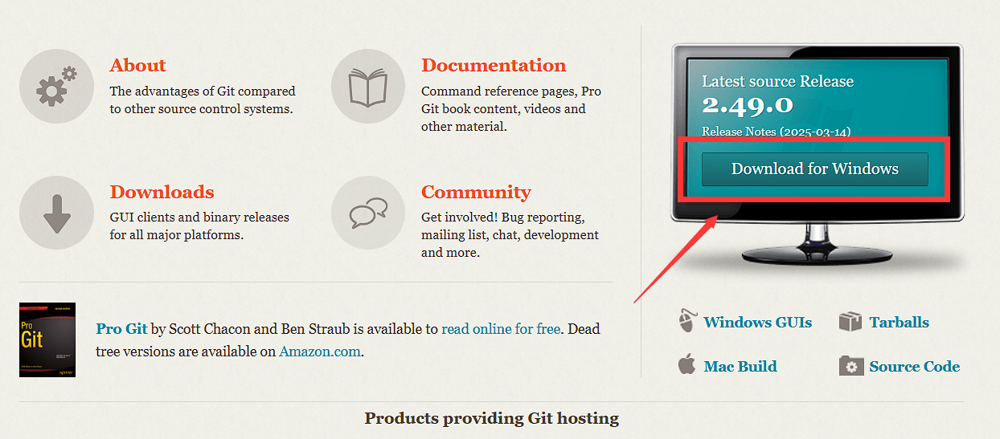
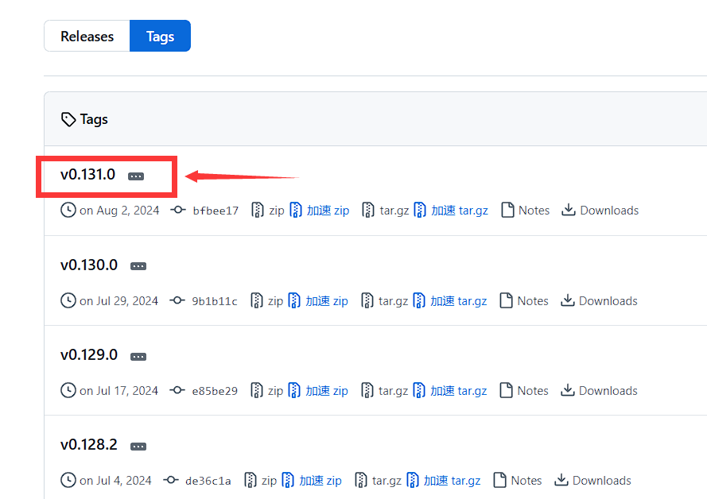
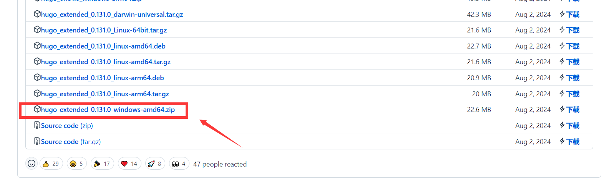
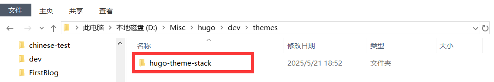
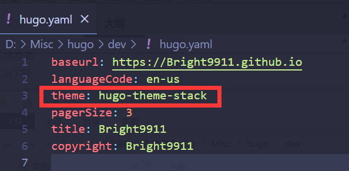
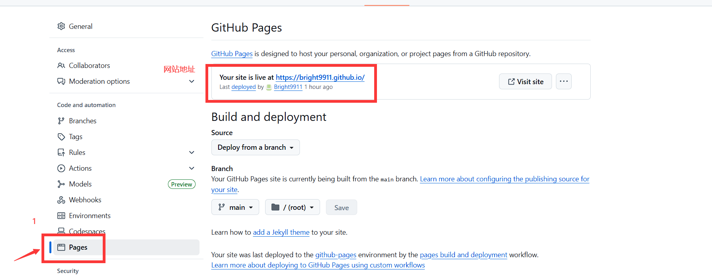
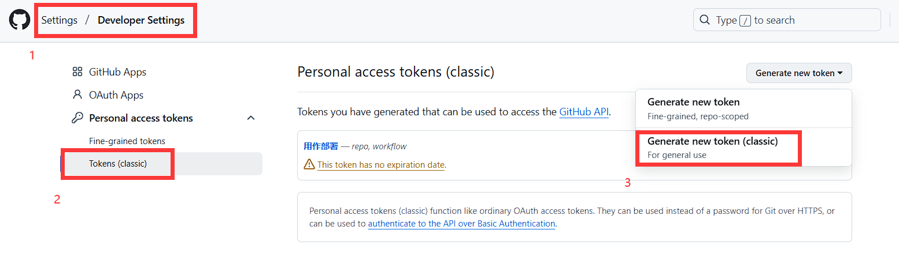
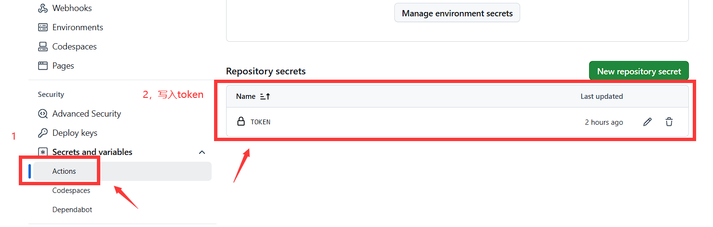

+++
title = 'Hugo+Github搭建个人博客'
date = 2025-05-23T14:53:41+08:00
draft = true
categories = [
    "hugo",
    "github",
    "笔记",
]
image = "the-creative-exchange-d2zvqp3fpro-unsplash.jpg"

+++

## 1、环境准备

### 1.1、Git下载

- 前往[Git](https://git-scm.com/)官网，下载安装程序
- 一直点下一步，默认安装即可



### 1.2、Hugo下载

- 前往[Tags · gohugoio/hugo](https://github.com/gohugoio/hugo/tags)下载对应版本



- Windows版本：**hugo_extended_xxxxx_windows_amd64.zip**



## 2、搭建博客

### 2.1、创建博客

- （1）在**hugo.exe**所在文件夹的地址栏敲打cmd，然后Enter唤起命令行

- （2）敲打命令`hugo new site xxxx`创建hugo文件

- （3）敲打命名`cd xxxx`切换目录，并把**hugo.exe**复制到刚生成的文件夹中

- （4）敲打命令`hugo server -D`启动服务，访问[http://localhost:1313](http://localhost:1313/)，Ctrl+C停止服务

   **（hugo默认是没有主题的，需要进行主题配置）**

### 2.2、配置主题

- （1）前往【[Hugo Themes](https://themes.gohugo.io/)】，查找自己喜欢的主题，进行下载
- （2）这边以【[Stack主题](https://github.com/CaiJimmy/hugo-theme-stack/tags)】为例，将下载好的主题解压，放到`/themes`文件夹中（这里我的网站名称是dev，从上一步创建博客的第2步中的xxx得来）



- （3）将`exampleSite`样例数据中的 **Content** 和 **hugo.yaml** 复制到主文件夹中，并删掉`hugo.toml`和`content/post/rich-content`
- （4）修改 **hugo.yaml** 中的 **theme**，将他修改为跟主题文件夹同名



- （5）再次启动hugo服务，查看主题，具体主题配置修改 **hugo.yaml**，这里不细说，感兴趣可自行查找相关文章

### 2.3、发布文章

- （1）使用以下命令生成文章（文章名无所谓，可以修改）

```bash
hugo.exe new content post/{文章名}/index.md
```

- （2）生成文章之后，在`content/post/{文章名字}/index.md`中编写文章

- （3）文章开头配置（自行修改）

```markdown
title = '{文章名}'
date = 2025-05-23T14:53:41+08:00
draft = true
categories = [
    "hugo",
    "github",
    "笔记",
]
image = "the-creative-exchange-d2zvqp3fpro-unsplash.jpg"
```

- （4）图片引入格式如下

```markdown

```

## 3、Github部署

### 3.1、常规部署

- （1）前往【[Github官网](https://github.com/)】，创建仓库 **{github用户名}.github.io**

- （2）前往`Setting -> Pages -> Branch`选择main分支，然后保存，会自动开启 **https://{github用户名}.github.io** 的地址，这地址也是以后访问博客的地址

- （3）回到hugo文件中，执行命令`hugo -D`，会生成 **public** 静态资源文件夹

- （4）在 **public** 执行以下命令上传到github仓库上，第一次上传可能需要输入账号密码

```bash
git init
git add .
git commit -m "first commit"
git branch -M main
git remote add origin {你的github仓库地址}
git push -u origin main

// 拓展
// 如果最后一行命令有问题可以先关闭ssl
git config --global http.sslVerify false
git push -u origin main
// 再开启
git config --global http.sslVerify true

// 修改之后再上传
git add .
git commit -m "修改描述"
git push    // 如果是团队协作，需要先新建分支，再上传合并
```

- （5）上传成功后访问 **https://{github用户名}.github.io**，成功搭建属于自己的Hugo博客


### 3.2、Github Action自动部署

- （1）Github创建一个新的仓库，用于存放Hugo的主文件
- （2）前往`Setttings -> Developer Settings -> Personal access tokens`，创建一个token(classic)



- （3）token选择永不过期，并勾选 **repo** 和 **workflow** 选项
- （4）为保证安全，将生成的token，保存的仓库的变量中，前往`Settings -> Secrets and variables -> Actions`中设置



- （5）在hugo主文件创建一个`.github/workflows/hugo_deploy.yaml`文件，将以下内容复制进去，想具体了解更多，可查看【[Github Action文档](https://docs.github.com/zh/actions)】

```yaml
name: deploy

# 代码提交到main分支时触发github action
on:
  push:
    branches:
      - main

jobs:
  deploy:
    runs-on: ubuntu-latest
    steps:
        - name: Checkout
          uses: actions/checkout@v4
          with:
              fetch-depth: 0

        - name: Setup Hugo
          uses: peaceiris/actions-hugo@v3
          with:
              hugo-version: "latest"
              extended: true

        - name: Build Web
          run: hugo -D

        - name: Deploy Web
          uses: peaceiris/actions-gh-pages@v4
          with:
              PERSONAL_TOKEN: ${{ secrets.你的token变量名 }}
              EXTERNAL_REPOSITORY: 你的github名/你的仓库名
              PUBLISH_BRANCH: main
              PUBLISH_DIR: ./public
              commit_message: auto deploy
```

- （6）在hugo主文件创建`.gitignore`文件，来避免提交不必要的文件

```
# 自动生成的文件
public
resources
.hugo_build.lock

# hugo命令
hugo.exe
```

- （7）将hugo的主文件上传到仓库，上传成功后会触发Github Action，来自动部署你的静态页面

```
git init
git add .
git commit -m "first commit"
git branch -M main
git remote add origin {你的github仓库地址}
git push -u origin main
```

- （8）之后修改页面只需要执行以下步骤即可

```
git add .
git commit -m "修改描述"
git push
```

